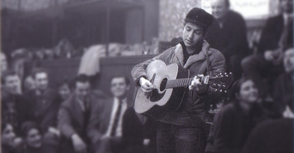

关于Blowin' in the Wind误解实在太多，我想多罗列一些确凿的信息，稍做一些基本的分析比较。

## 创作时间和背景

为什么要抠时间和文化背景？这是再基本不过的常识，因为这关乎他当时为什么而写，听众为什么接受，这是不可更改的作品本意。至于后来的听众把它听成这个那个，很多是断章取义的用法，不值一提。

这首歌的创作日期几乎可以肯定是1962年4月16日，当时和Dylan在一起的是David Blue。David多次回忆起那天的情景，包括在电影Renaldo & Clara中。

> 那个周一下午，Dylan和我在名叫Fat Black Pussycat的店喝咖啡瞎聊，消磨时间。5点左右，Dylan拿出吉他和纸笔，拨着和弦为新歌胡诌歌词。过了一会，他让我为他弹吉他，这样他更容易把握音韵。我们这么捣鼓了约莫一小时，直到他满意。这首歌就是Blowin' in the Wind。我们决定带这首歌去见Gil Turner，Gerde's民谣城周一晚上的演出是他主持。我们赶到大概是9点半……Gil Turner终于歇了下来，来到地下室准备下半场演出。Bob叫过Gil，用他卓别林式的结巴紧张地说：“我有首歌你来听听，伙计。”Bob一边说，一边嘴都趔到耳根子了。Gil说：“好的，Bob。”他靠近，周围差不多有一圈人围着他俩。Bob激情满满地唱完，周围一片安静。Gil被震住了，“我这就要亲自唱这首歌。”……当他唱完所有的观众都起立欢呼，Bob倚靠着大厅后面的一个柱子，喜不自胜。

第一次演唱之后不久，Dylan为原本只有两个叙述段的歌又加写了一段，刊载于1962年5月的第六期Broadside杂志，6月，又出现在Sing Out!杂志中。新泽西某高中学生从杂志上学了这首歌后，在学校演出中唱过。因为这甚至发生在Peter Paul & Mary推出的单曲之前，于是有谣传这首歌是这个学生原创。Newsweek杂志更添油加醋地在1963年11月刊出，Dylan是花1000美元从该学生那儿买下的Blowin' in the Wind。这当然是对时间顺序不加核实的无稽之谈，更离奇的是之后对这首歌各种解读的时间倒错。

流传广泛的谬论是说Blowin' in the Wind的背景是越南战争，所以歌曲涉及的每个问题都和战争有关。尽管美国早在1954年法国撤出越南之后，就介入支持南越西贡政府，但是真正大规模派兵卷入对越地面作战，是在1964年8月国会通过“东京湾解决方案”之后，美国民众有针对性的反越战活动也是在此之后。这就是说两年多之前Dylan创作Blowin' in the Wind根本没有越战的背景，他没有越战的概念，这首歌的传唱者和听众也没有。在创作之初，歌中涉及到的战争只不过泛指，与第一次世界大战，第二次世界大战，朝鲜战争，美苏频繁摩擦制造的恐怖气氛甚至更多都不无关联。至于日后被用在反越战，反入侵阿富汗、伊拉克、利比亚如此等等场合，可能贴切，也可能不贴切，但与创作背景无关。而且，Dylan本人从未公开参加反越战活动，也没有明确为反越战创作过一首歌。

还有人说，Blowin' in the Wind的背景是冷战，考虑到古巴导弹事件就在那期间。这还是时间倒错问题，美国民众知道有古巴导弹这么回事，是1962年10月22日肯尼迪总统在电视首先告诉大家的。它不仅不是Blowin' in the Wind的创作背景，甚至不是The Hard Rains Are Gonna Fall的背景。创作背景只能是之前或当时社会的事件和思潮，明天的事怎么会影响到今天的想法和心情？

事实是，这首歌的创作动机主要是针对种族歧视，背景是民权运动在全美各地引发的冲突。在过去的一年，1961年，震动全美国视听的是“自由之行”——黑人白人同乘巴士穿过南方诸州，由华盛顿去往新奥尔良，抗议南方在包括公交车、候车室、餐厅甚至卫生间实行种族隔离。从5月初到月底，媒体不断呈现在大众面前的是：抗议者被打得头破血流，巴士被焚烧，司机拒驾，警察不作为，3K党惨无人道的行径，联邦政府反复斡旋施压，军警或联邦军队多次出动，抗议者多次被捕。当月，就在“自由之行”经过密西西比的时候，黑人学生James Meredith正在为进白人大学就读抗争。该事件同样牵涉进联邦政府和军队的干预，最后导致牛津城严重骚乱，三人死亡多人受伤。就在Dylan创作Blowin' in the Wind当时，始于1961年底的佐治亚州阿尔班尼民权抗议仍处在胶着状态，每天都有黑人被投入监狱，从成年人到小学生，每天打开电视都看得到冲突场面。Dylan当时的女友Suze Rotolo当时就在为种族平等协会（CORE）帮忙，而CORE就是策划执行“自由之行”的民权组织。在纪录片No Direction Home中Suze说：

> 我当时正为种族平等协会工作，那段时间真是难以置信。电话打进来，人们会说“哦，天哪，谁谁谁被打得血肉模糊，谁谁谁进了医院。”那样的经历真是摧残人，我感觉自己都要疯了。这简直疯了！为什么会有这样的事？我敢肯定Bob是同样的，你真的难以忍受。你生活在个人志趣的小圈子，但肯定无法与外面的世界隔绝。

总之，Blowin' in the Wind主要涉及的问题是种族歧视，捎带涉及战争，并拷问道德良知缺失的政要和民众。如果说很多白人还听不太明白，那么黑人的反响强烈足以说明问题。仅一年多时间，Dylan从一个默默无闻的酒吧小歌手，成了许多民权组织的座上宾。1963年8月28日，他甚至应邀在马丁·路德·金发表那篇著名演说同一天同一讲坛上演唱，成为万众瞩目的几位白人歌手之一，用歌声传递自己的想法。

## 歌词的文本内容

文艺作品可以只关乎个人经历和感受，只关乎个人经历和感受也能引发共鸣，但这要看在什么时代。纵欲文化盛行的年代，文化特征就是自恋或自怜，个人自慰可供人人自慰。但我们说的是美国的60年代，听众都说Blowin' in the Wind涉及种族歧视，战争威胁和道德缺失，Dylan本人一直说的也是这个，凭什么冒出与文化背景无关的念头？其实所有英文资料中都会说到这首歌是民权运动主题歌，问题是不少人甚至不知道民权运动是什么，对文化背景一知半解却以为很了解。还有一些人是理解歌词的语言能力不济，跟着身边嗓门大的瞎起哄。前面说了Blowin' in the Wind的背景，下面来解读歌词文本。

歌曲有三个叙述段，每段提出三个问题，然后每段以“答案吹飞在风里”结束。歌曲招致热议的是Dylan关于答案的表述和想法，但在美国，至少在60年代，歌中提出的9个问题是没有歧义的。即使是Dylan最讨厌的采访记者也没有在问题的理解上与Dylan有过冲突。而在中文书籍和网络中，问题最多的却是这些问题就没理解。我们先来看看这9个问题。

**How many roads must a man walk down before you call him a man?**

第一个问题或许应当翻译成这样才好理解：“一个man要走多少路你才会称他为man？”在我见到的资料中，美国人似乎普遍对这一句的理解是“什么样的男人不被叫做男人？”而多数中国人联想到的是“男孩什么时候变成男人？”至于是语言问题还是文化问题我们姑且不去辨析，总之歌曲的第一个问题就引出了种族问题。Dylan曾经的好友Mavis Staples在纪录片No Direction Home中说得很清楚：

> 他怎么能写出“一个人要走多少路你才会把他称做man？”这是我父亲的经历。他就是个不被叫做“man”的人，知道吗。就是说，他打哪儿来呢？白人没有苦难的经历。这是我当时的想法，因为我也是年轻人。他写的东西激动人心，知道吗？感人的歌曲，它们激动人心，就像福音歌曲。他所写的就是真理。

不被称做man，称做什么？BOY。在种族歧视的文化当中，黑人无论年龄多大都被叫做boy，Mavis的父亲是，很多早期美国电影中的黑人也都是这种待遇。在Janis Ian的歌曲Society Child中，白人女孩的黑人男朋友被女孩的妈妈叫了一声boy，眼里涌出羞愤的泪水。所以黑人对这首歌的第一个问题非常敏感，身处种族歧视文化中的白人也很清楚。第一个问题其实就是：“黑人什么时候才能被白人尊重？”

**How many seas must a white dove sail before she sleeps in the sand?

**第二个问题用了象征，白鸽象征和平，而鸽子不会“睡在沙里”，所以“睡在沙里”的意思是死去。一般解释到此为止，但如果是“和平在死前要航行多少海面？”这句话几乎无法理解。认定这首歌为反战歌曲的人由“死去”联想到士兵，可士兵再怎么无辜也没有用白鸽象征的。那么是呼吁和平的反战示威者？可60年代初期很少有反战示威，此起彼伏的示威是民权运动示威。这些示威者是和平抗议者（nonviolent demonstrator），所以他们才是和平鸽。而且我个人观念中，“白鸽”应该更具体地象征民权运动示威者当中的白人才感觉贴切。事实是，参加民权运动抗议示威的白人要冒更大的风险，在冲突中会受更大的伤害。“自由之行”抗议活动中每次暴力伤害的目标主要是都是白人，有几个人落下了终身残疾。Suze Rotolo在自传中专门提到伯明翰遭遇的暴行。

> 这一暴行被摄影机记录了下来，很快就被全世界的人看到了。也许今天的我们对电视上出现这类暴行已经司空见惯，但我记得当时我看到那个画面时，一股寒气直从脚底往头顶上蹿。连詹姆斯这样的白人也成为暴徒袭击的对象，白人社会该引起注意了！

Dylan的民权意识来自Suze，大多与之交流感受，所以两人敏感点应当很接近。因此我猜想Dylan提出这个问题时想到的是为社会公正挺身而出的白人，重要的是这使表述意象合理，文本意义连贯。当然，但凡使用了象征，即符号化或编码处理，作者大多不愿意自己解码，所以甭指望Dylan自己来告诉你那一句什么指征。然而，作者使用了代码并不是希望受众不要解码，或者随便解析成什么样的乱码，他当然既期待听者或读者自行解码的过程，也期望结果八九不离十，除非作者自己脑袋里一团浆糊。所以我对第二个问题八九不离十的解读是：“白人民权积极分子要冒死完成多少任务？”去掉我个人联想这句的确定意思是：“民权示威者还要冒死完成多少任务？”

**How many times must the cannon balls fly before they're forever banned?

**第三个问题比较简单，基本没有分歧，就是：“迫击炮弹还要飞多少次才会被彻底禁止？”但不少人对这首歌的确定理解只有这一句，并以此确定歌曲的主题是反战，并以此曲解其他句子。可以肯定的是，Dylan提出这个问题时根本想不到越战和古巴导弹。至于这里Dylan所指的到底是什么样的战争，这牵涉到他对战争本质的认识，我会在后面讨论答案时论及。的确，这个问题涉及到战争，何时能终止战争是这首歌涉及的问题之一。

**How many years must a mountain exist before it is washed to the sea?**

第四个问题又使用了象征：“一座山要存在多少年才会被冲入大海？”“山”在英语中的一般象征意义是“阻碍”或“边界”，和中文差不多。联系到民权运动中的阻碍，显然是当时南方白人经常宣称的，种族歧视是他们珍视和维护的传统。因此这个问题可以解释为：“种族歧视还要存在多久才会被清除？”

**How many years can some people exist before they're allowed to be free?**

第五个问题非常清楚：“有些人还要存在多久才能获准自由？”这些人当然说的是黑人。这里用到“获准”（are allowed to be）似乎别有用意。华盛顿宣布“人人生而平等”，可黑人是白人的奴隶。林肯宣布解放黑奴，给黑人自由，可黑人还是不自由。还要等谁来恩准？这里展开了可以说很多，省略了。Peter Paul & Mary三位成员说起他们在民权运动集会上演唱这首歌时，都是对这一句感触良多。不排除有些人是听到这一句，才明白这首歌的主题是为黑人鸣不平。

**How many times can a man turn his head, an' pretend that he just doesn't see?

**第六个问题也很清楚：“是个男人还要多少次扭开头，假装没看见？”Dylan开始将前面的问题更深入了一步，敦促更多人正视社会不公。他在接受Gil Turner为Sing Out!杂志采访中说：

> 我还是要说，最大的罪犯是那些明明看到错也知道错，却扭开头的人。

这段采访登载在1962年10/11月刊上，可见当时他还停留在指责人或事的认识阶段。后面我会从多首歌来分析这一点。但这一问涉及的是道德良知，往俗里说这句话就是：“你的良心是不是让狗吃了？”

**How many times must a man look up before he can see the sky?

**第七个问题又是象征：“一个人还有多少次仰望，才能看到天空？”这和中国人象征用法差不多，“天空”象征未来，“看到天空”是说能看得很远，看得到希望。中国人说“暗无天日”是无望，“云开雾散”是有望。大量接触西方的传统歌曲，不是觉得东西方差异大，而是差异小。我认为文化差异是越高雅越大，越低俗越小，流行歌曲的脊梁恰恰是低俗文化的价值观。那么这一问既可以说是：“黑人什么时候才能看到希望？”也可以说是：“我们什么时候能看到没有战争的世界？”是对前面问题重复催问：“到底还有多久？还有望无望？”

**How many ears must one man have before he can hear people cry?

**第八个问题：“一个人要长多少耳朵才能听到人们的哭声？”应该是对扭开头的重复逼问，前面指责缺德的人不看，这句谴责他们不听，往俗里说就是：“你耳朵塞驴毛了？”

**How many deads will it take till he knows that too many people have died?

**第九个问题，最后一问，还是逼问道德冷漠，良知缺失的人：“到底要死多少人他才觉得算多？”对那些不看不听，或视而不见，听而不闻的人，这当然是多余的。所以这应当是指那些明知要死人，却把死人当作必须代价的决策者。这些决策者不仅仅是将军，警长，州长，总统，还有他们后面的势力，这一点Dylan非常清楚。这一问尽管可以指种族歧视致死的人，但主要还是指战争。用它做最后一问显然指向了战争的始作俑者，他们就是要通过死人来创造利益，对此Dylan似乎很早就概念非常清楚。

经上述详细拆解可以看出，九个问题核心只有两个问题：“何时能结束种族歧视？”“何时能终止战争？”其它的问题要么是从不同角度重提这两个问题，要么是探究导致这两个问题的问题。接下来该关注的就是这首歌三个叙述段，每段最后的重复句（refrain）：

**The answer, my friend, is blowin' in the wind 
The answer is blowin' in the wind**

这句话其实意思很明确，就是“答案被吹到风里”。但你看看各种中文译名：“随风而逝”，“随风飘荡”，“随风飘散”，“答案在风中飘”，“响在风中”，就不觉得有这样的疑问，到底有还是没有答案？跳过推理判断，看Dylan本人怎么解释。还是在Sing Out!杂志1962年10/11月一期上，他接受Gil Turner采访时说的：

> 关于这首歌我只能说答案被吹到风里，它不在任何书或电影或电视或讨论中，它在风里，被吹在风里。太多牛人告诉我答案在哪，可我不信。我还是说它在风里，就像飞舞的纸片有时会落下来……但问题是，即便它落下来也没人会捡起，让更多的人看到并相信，它只会又飞掉。

不管别人怎么理解，在Dylan概念中显然原本有答案，原本可以抓住，可以看清，但没等你看清就被风吹跑了。被吹跑了但还在风里，并未消失。你如果准备好了，还能抓住，还能看清。他这么一说把原本似乎简单的事儿说复杂了，原本轻描淡写的话变得相当深刻了。到底答案是什么？如果Dylan脑袋里没有个大概轮廓，他怎么知道人们谈的都不是？风是什么，为什么会有风吹走答案？为什么人们不信，怎么才能让人们相信并抓住答案，解决问题？Dylan自己也在专辑Freewheelin' Bob Dylan的封里说明中问了这样的问题：

> 回答歌中问题的第一步是提出问题，但很多人首先得知道风从哪里吹来。 

“我不认为它具有号召力”

尽管Dylan享受Blowin' in the Wind带来的一切荣耀，可他本人从未自夸过这首歌。在2005年推出的纪录片No Direction Home中，他说：

> 我并不清楚那首歌是好是坏，或者……感觉还成。我可真不清楚……它具有号召力还是什么的。

1966年2月，在接受Martin Bronstein采访时他说：

> 你是不是说我写过的最率直的歌？而后又流行了是吗？很少，很少这样的。Blowin' In The Wind只是一定程度上这样，而我当时只是个孩子，你知道吗，我是说我自己当时尚且一无所知，我只不过写下所想，知道吗，所以它也还算不上。

Dylan不看好Blowin' in the Wind是有道理的。尽管很多人喜欢，很多人甚至评价很高，Joan Baez第一次听过之后甚至给出租车司机夸这首歌，但还是有少数人评价不高。Pete Seeger立即指出这首歌的曲调借自一首黑人福音歌曲No More Auction Block。Pete和Tom Paxton等左翼歌手还认为，光提问题给不出答案，歌曲力道不足。这就是为什么Dylan回说：“回答歌中问题的第一步是提出问题。”可能真正打击他较大的是他敬重的朋友Dave Van Ronk。Dylan创作，Turner演唱后的第二天，Dave就要他别唱了，说：

> 天哪，Bobby，这首歌简直太蠢了！我是说什么玩意儿嘛，吹在风中？

尽管几周之后Dave就改口说，听到街上小孩都改了词唱这首歌，他知道Bobby创作了一首杰作，但Dylan一定是认同了这种批评。因为自1963年6月新港民谣音乐节到1971年8月援助孟加拉国音乐会长达8年时间里，Dylan将Blowin' in the Wind排除于演唱曲目之外。1971年当George Harrison问他唱不唱Blowin' in the Wind时，他反问George，你咋不唱She Loves You？即使自那以后的几十年当中Blowin' in the Wind重新成为保留曲目，Dylan却不止一次地解释过，因为这些歌已不再属于他自己，而是属于听众，听众要听他唱他们的歌。

这首歌到底好在哪里，差在哪里？为什么有些人奉为神明，包括他自己在内的另一些人却不以为然？（以下省略三百字。）

我们不得不面对的事实就是，即使是在需要思想的60年代，多数人需要的还是肤浅的触动，而不是深刻的思想。今天就更是这样了，今天的中国尤其过分。你可以用这首歌作为试金石，那些标榜自己喜欢Bob Dylan的人如果首选Blowin' in the Wind，多半是冒牌货。

## 到底风从哪吹来？

我在2012年课程考核时出了这个问题：既然Dylan说答案被吹到风里，又说“首先得知道风从里吹来”，而且直到1965年他居然还没完，在歌中唱道：“你不需要气象员告诉你风从哪吹来吧？”那么根据这学期课程中你对Dylan的理解说说“到底风从哪吹来”。

首先，要搞清楚问题是什么。如本文前面分析，主要两个问题：种族歧视和战争。接着演绎，既然风把答案吹走，那么风是干扰，是干扰人们把握答案，看清答案并解决问题的做法。那么，风从哪吹来？从坚持种族歧视和发动战争的人那里。可他们又为什么坚持做这些伤天害理的事？Bob Dylan认为没有邪恶的人或事，只有邪恶的原因。所以最终要找出为什么有人坚持伤天害理，才算是找到了风从哪吹来。分析至此，就涉及到种族歧视和战争的本质认识问题。因为我的课通过分析作品和文化背景得到并反复强调利益驱动一切邪恶的本质，所以直接说出本质是利益驱动并不难，难的是你是否真能看出来利益是如何驱动种族歧视和战争的。

揭示利益是如何驱动种族歧视和战争的，其实也不难，你只要梳理一下Bob Dylan涉及种族歧视和战争的代表作，就能准确无误地找到线索。用Dylan系列作品作为细节，佐证对其认识的理解是最可靠的，远比他在采访或私下的言论可靠。Suze Rotolo也认为：

> 人们总是抱怨他对自己的事情太讳莫如深——为什么不能多透露些呢？我真不懂这些人，歌曲和歌词是鲍勃的核心价值，他的作品就是他的意义所在。要了解他，分析他的歌词就好了。”

通过歌曲分析Dylan揭示种族歧视和战争是如何被利益驱动，我们要先分析战争的本质，它相对清晰一些，而且Dylan从创作一开始似乎就看到了本质。（以下省略800字。）

## 到底有没有答案？

Dylan非常清楚这个那个都不是答案，这是一回事，清楚知道答案却是另一回事。理想主义可以有确定的方向，却从来没有完善的方法。更何况不在其位，不谋其政，凭什么跟一个唱歌的要拯救世界的良方？Dylan在I Shall Be Free中给过肯尼迪总统国家繁荣的良方：

> 我的电话响了，响个不停  
> 是肯尼迪总统在找我 
> 他说“鲍勃我的朋友，怎么做才能让国家繁荣？” 
> 我说“约翰我的朋友，碧姬·芭铎 
> 安妮塔·爱克伯格 
> 索菲亚·罗兰…… 
> 国家就兴旺”

《花花公子》杂志记者Nat Hentoff在1965年秋采访Dylan时问，如果他是总统，他会做什么。他是这样回答的：

> 首先我根本不想这些事，这只能是离奇想象。如果我是总统，我会让白宫所有人立即走人。我有彻底改变白宫，使得所有在那儿工作的人彻底改变视角……人人都必须穿高领衬衣。必须有一个区，人人在领带上别花，有完全不同的一套主角。除了和马丁·路德·金谈事情，我还会与Roebuck Staples谈事，他会做白宫发言人，你知道。所有地方都彻底重新装饰，要有秋千，跷跷板……第一周就是聚会，持续进行。我会邀请毛，邀他来看看我们怎么了。我不知道他做何感想。你知道，我看过他和那些持枪女孩的照片，我知道他也许希望他的女人坚强。他来此也许会大吃一惊。必须安排一些坚强女人迎候，知道吗，在大厅。我会为他准备好的，知道吗，如果他来的话，没问题。

